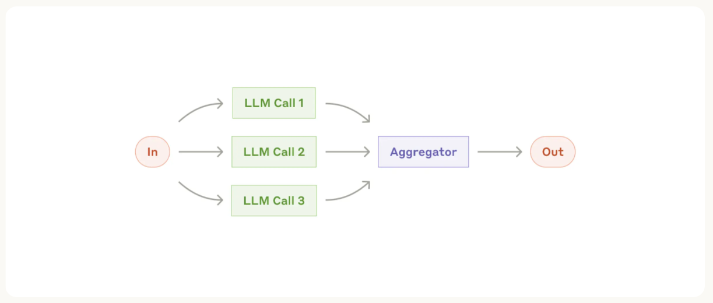

# Sustainable Farming Agent System

Multi-agent framework using Pydantic AI and LangGraph. This project implements a multi-agent sustainable farming system that helps users plan their perfect farming requirements through an interactive Streamlit UI.


## Overview

This project implements a sophisticated planning system that uses multiple specialized AI agents working in parallel to create comprehensive plans. The system collects user preferences and details through a conversational interface, then simultaneously processes all recommendations before combining them into a final plan.

All tool calls for the agents are mocked, so this is using offline synthetic data provided! This is simply built as an example, focusing on the agent architecture instead of the tooling.

## Features

- **Interactive Streamlit UI** with real-time streaming responses
- **Multi-agent architecture** with specialized agents for different aspects of planning
- **Parallel processing** of recommendations for improved efficiency
- **User preference management** for sustainability, farming advisory, and market intelligence
- **Conversational interface** for gathering details
- **Comprehensive plans** with sustainability, farming advisory, and market intelligence

## Architecture

The system consists of five specialized agents:

1. **Info Gathering Agent**: Collects necessary details (market research and farming advisory datasets)
2. **Sustainability Agent**: Recommends sustainable farming practices to reduce environmental impact
3. **Farm advisor Agent**: Suggests best farming practices based on data and weather forecasts
4. **Market intelligence Agent**: Recommends market intelligence based on data provided
5. **Final Planner Agent**: Aggregates all recommendations into a comprehensive  plan

These agents are orchestrated through a LangGraph workflow that enables parallel execution and dynamic routing based on the completeness of gathered information.

## Technical Stack

- **Pydantic AI**: For structured agent definitions and type validation
- **LangGraph**: For orchestrating the agent workflow and parallel execution
- **Streamlit**: For building the interactive user interface

## Setup Instructions

### Prerequisites

- Python 3.11 or higher
- OpenAI or OpenRouter API key (can use Ollama too)

### Installation

1. Clone the repository:
   ```bash
   git clone https://github.com/yourusername/Multi_agent_sustainable_farming.git
   cd sustainable-planning-agent
   ```

2. Set up a virtual environment:

   **Windows**:
   ```bash
   python -m venv venv
   venv\Scripts\activate
   ```

   **macOS/Linux**:
   ```bash
   python3 -m venv venv
   source venv/bin/activate
   ```

3. Install dependencies:
   ```bash
   pip install -r requirements.txt
   ```

4. Create a `.env` file in the root directory and follow the instructions given in `.env.example`:
   ```
   PROVIDER=
   BASE_URL=
   LLM_API_KEY=
   MODEL_CHOICE=
   ```

### Running the Application

1. Start the Streamlit UI:
   ```bash
   streamlit run streamlit_ui.py
   ```

2. Open your browser and navigate to the URL displayed in the terminal (typically http://localhost:8501)

## Usage

1. **Set Your Preferences**: Use the sidebar to upload all the dataset files.

2. **Start a Conversation**: Type your request in the chat input. For example:
   ```
   I want a data driven solution for sustainable farming. Please provide a curated plan according to the data provided.
   ```

3. **Interact with the Agent**: The system will ask follow-up questions if any details are missing.

4. **Review Your Plan**: Once all details are collected, the system will generate a comprehensive plan with data driven recommendations.

Note that with this demonstration, once the final plan is given to you, the conversation is over. This can of course be extended to allow for editing the trip, asking more questions, etc.

## Project Structure

```
sustainable-planning-agent/
├── agents/                                        # Individual agent definitions
│   ├── sustainability_optimizer_agent.py          # Agent for recommending sustainable farming practices
│   ├── final_planner_agent.py                     # Agent for creating the final travel plan
│   ├── market_intelligence_agent.py               # Agent for market intelligence recommendations
│   ├── farmer_advisor_agent.py                    # Agent for best farming practices recommendations
│   └── info_gathering_agent.py                    # Agent for collecting details
├── agent_graph.py                                 # LangGraph workflow definition
├── streamlit_ui.py                                # Streamlit user interface
├── utils.py                                       # Utility functions
├── requirements.txt                               # Project dependencies
└── README.md                                      # Project documentation
```

## How It Works

1. The system starts by gathering all necessary information from the user through the Info Gathering Agent.
2. Once all required details are collected, the system simultaneously calls the all three agents to get recommendations.
3. Each specialized agent uses its tools to search for and recommend options based on the user's preferences.
4. After all recommendations are collected, the Final Planner Agent creates a comprehensive plan.
5. The entire process is streamed in real-time to the user through the Streamlit UI.

## Inspired by Anthropic's Agent Architecture

This project is a demonstration of the parallelization workflow showcased in [Anthropic's Agent Architecture blog](https://www.anthropic.com/engineering/building-effective-agents). The implementation follows a similar pattern where multiple specialized agents work in parallel to solve different aspects of a complex task.



The key architectural pattern demonstrated here is the ability to:
1. Gather initial information
2. Fan out to multiple specialized agents working in parallel
3. Aggregate results into a final, comprehensive response

This approach significantly improves efficiency compared to sequential processing, especially for complex tasks with independent subtasks.

## Customization

You can customize the system by:

- Modifying agent prompts in the respective agent files
- Adding new specialized agents for additional travel aspects
- Enhancing the tools with real API integrations for all agents
- Extending the user preference system with additional options


## Acknowledgments

- Built with [Pydantic AI](https://github.com/pydantic/pydantic-ai)
- Powered by [LangGraph](https://github.com/langchain-ai/langgraph)
- UI created with [Streamlit](https://streamlit.io/)
